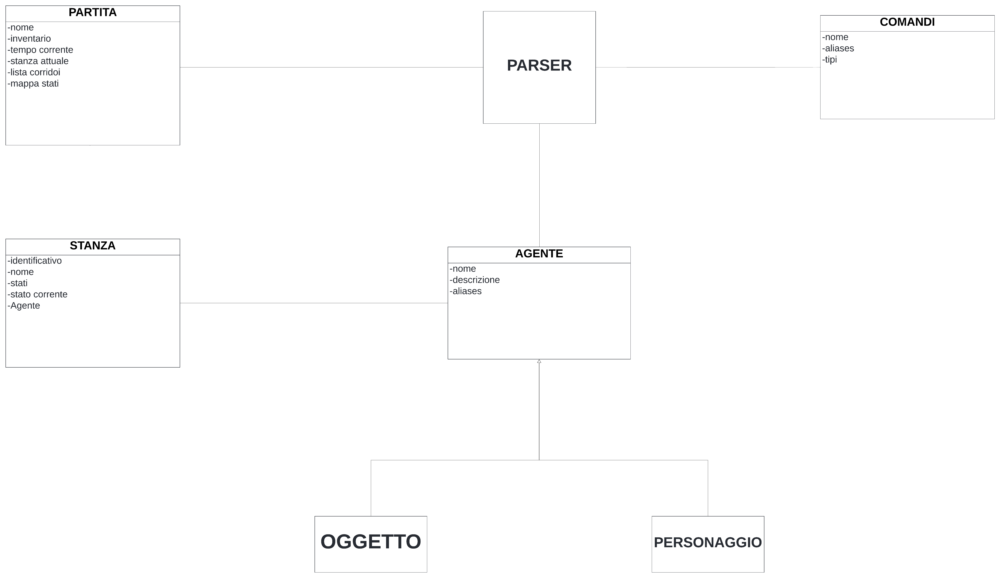
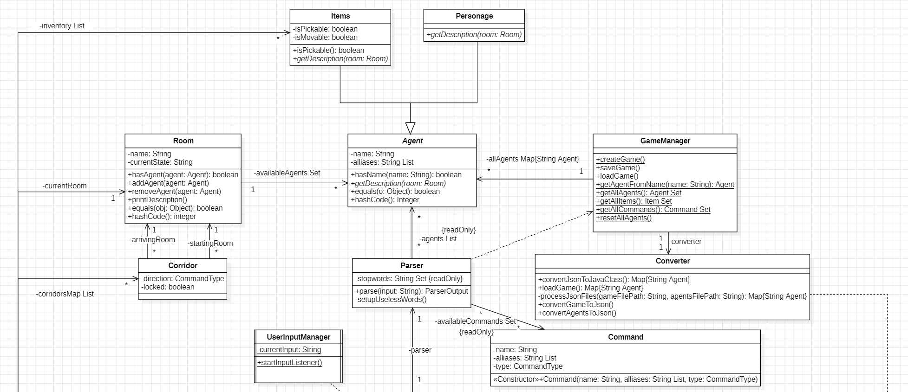
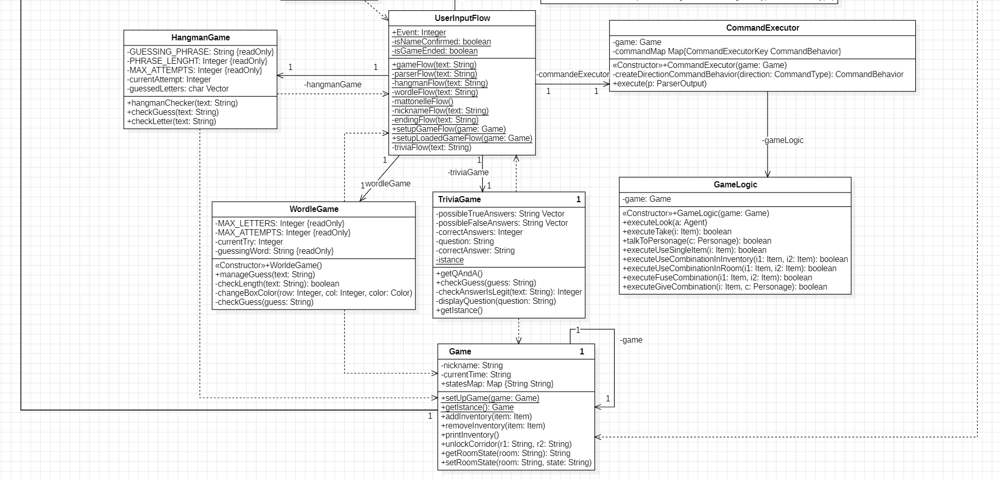

# Metal Gear

# Report
## Indice
- ### [Introduzione](#1---introduzione)
- ### [Modello di Dominio](#2---modello-di-dominio)
- ### [Progettazione](#3---progettazione)
- ### [Specifiche Algebriche](#4---specifiche-algebriche)
- ### [Applicazione Argomenti del Corso](#6---applicazione-argomenti-del-corso)
- ### [Javadoc](#7---javadoc)
- ### [Manuale Utente](#8---manuale-utente)
- ### [Walkthrough](#81---walkthrough)
- ### [Conclusioni e Opinioni Finali](#9---conclusioni-e-opinioni-finali)

## 1 - Introduzione
## Partecipanti al progetto

Il team di sviluppatori è composto da:
+ **Fabrizio Giuseppe Mazzilli** ([Ffabrik](https://github.com/Ffabrik))
+ **Francesco Ricci** ([RelaxOrIFrsb](https://github.com/RelaxOrIFrsb))
+ **Marco Vilardi** ([Maku-vi](https://github.com/Maku-vi))

## Descrizione Progetto

### Nome Progetto: Metal Gear
#### Introduzione generale

Questo progetto, intitolato **Metal Gear**, è stato sviluppato come esame finale del corso di **Metodi Avanzati di Programmazione**, tenuto dal Prof. [Pierpaolo Basile](https://github.com/pippokill) presso l'Università degli Studi di Bari "Aldo Moro".

L'obiettivo del corso è stato quello di introdurre, conoscere e approfondire un ulteriore paradigma di programmazione, ossia la **Programmazione ad Oggetti** e di andare ad utilizzare i concetti appresi per la realizzazione di un progetto software.

In particolare la realizzazione di un'avventura testuale, un genere non più molto diffuso ma che ha avuto un ruolo fondamentale nella storia dei videogiochi.

### Che cosa è un'avventura testuale?

Un'avventura testuale è un tipo di videogioco in cui il giocatore interagisce con il mondo di gioco tramite comandi testuali. Questi giochi erano particolarmente popolari nei primi anni dell'era informatica, quando l'elaborazione grafica era limitata.

#### Caratteristiche Principali

- **Interfaccia Testuale**: l'interazione avviene tramite comandi scritti, come "nord", "prendi chiave" o "guarda".
- **Descrizioni Dettagliate**: il gioco descrive le scene, gli oggetti e le azioni attraverso testi dettagliati, stimolando l'immaginazione del giocatore.
- **Enigmi e Puzzle**: i giocatori devono risolvere enigmi o puzzle per avanzare nel gioco, utilizzando l'inventario degli oggetti raccolti.

Le avventure testuali hanno contribuito significativamente allo sviluppo dei giochi di avventura e dei giochi di ruolo moderni, ponendo le basi per le esperienze narrative interattive.

### Trama del Gioco

Il mondo è sull'orlo di una crisi globale. La geniale Dottoressa Irene Weissmann, pioniera nel campo dell’intelligenza artificiale, è stata rapita dall'organizzazione terroristica segreta "Black Hand". Il loro obiettivo: sfruttare le sue conoscenze per creare una nuova generazione di armi autonome, capaci di destabilizzare l’equilibrio mondiale.

Nei panni di Snake, la tua missione è infiltrarti nella base segreta di "Black Hand" e salvare la Dottoressa Weissmann prima che le sue ricerche vengano utilizzate per scopi distruttivi. Il tempo stringe, la pressione aumenta e ogni secondo conta. Il fallimento non è un'opzione, il destino del mondo dipende da te.

Sei pronto, Snake? È ora di entrare in azione. La tua missione d’infiltrazione inizia ora. Buona fortuna!

Ricorda che se rimani bloccato in una stanza della base, puoi sempre chiedere aiuto via Codec al colonnello Roy Campbell;  grazie agli strumenti a vostra disposizione, ha già mappato la base e probabilmente  ha caricato la soluzione dell'enigma nel [[Walkthrough](#walkthrough) del gioco via Codec.

### Implementazione del Progetto

Il progetto è stato realizzato utilizzando il linguaggio di programmazione **Java** affiancato al framework **Maven** per la gestione delle dipendenze e la compilazione del progetto e comprende le seguenti funzionalità principali:

- **Parser**: trattandosi di un'avventura testuale, il parser è il componente principale del gioco, responsabile di interpretare i comandi inseriti dall'utente e di tradurli in azioni.
- **Database**: il gioco include un database, in particolare **H2**, utilizzato per contenere le descrizioni delle stanze, degli oggetti, dei personaggi ed altre informazioni utili.
- **Thread**: il gioco utilizza i thread per non rendere conscio il giocatore di ciò che sta succedendo in background, dal momento che sarà accompagnato da una musica di sottofondo adatta all'ambientazione del gioco.
- **File di Configurazione**: il gioco include un file di configurazione in formato **JSON** per creare una nuova partita o caricare una partita salvata.
- **Socket / REST**: il gioco include un server socket, sulla porta 8080, per visualizzare direttamente sul browser le informazioni più importanti e per permettere di leggere l'intera avventura di Snake dall'inizio alla fine direttamente dal browser.
- **API**: il gioco include un'API per generare parole casuali per il minigioco della **AI malevola** e un'API per generare domande casuali per il minigioco del **Trivia**.
- **GUI**: nonostante il gioco sia testuale, è stata implementata una GUI per visualizzare le informazioni principali del gioco, come la stanza corrente e l'inventario del giocatore.

#### [Ritorna all'Indice](#indice)

## 2 - Modello di Dominio

Il seguente diagramma rappresenta il modello di dominio della nostra avventura testuale, realizzata utilizzando il web software [Lucidchart](https://www.lucidchart.com/)

  

Questo modello ha sancito la base per il nostro progetto. 

A partire da quest'ultimo infatti, abbiamo potuto definire le classi e le relazioni tra di esse, in modo da poter realizzare un'architettura solida e ben strutturata.

#### [Ritorna all'Indice](#indice)

## 3 - Progettazione
- Il nostro principale obiettivo di progettazione è stato:
    - Creare un'architettura modulare e scalabile che permetta di aggiungere nuove funzionalità in modo semplice e flessibile.

## Diagramma delle classi
Il seguente diagramma rappresenta le classi del nostro progetto, realizzato utilizzando il software [StarUML](https://www.lucidchart.com/)

Il diagramma rappresenta il funzionamento del nostro progetto, le classi rappresentano le seguenti informazioni:
- **UserInputManager**: Questa classe è sempre in ascolto tramite un Thread, per ricevere gli input inseriti dall'utente.
- **UserInputFlow**: Questa classe è responsabile di gestire il flusso di input dell'utente,
in particolare si occupa di passare l'input dell utente a seconda dell'evento di gioco in cui il giocatore si trova, indicato dall'attributo event della classe.
Questa classe viene definita come una classe statica, per facilitare l'uso dei suoi funzionamenti nelle altre classi senza andare a creare un oggetto o una copia d'oggetto.
- **CommandExecutor**: Questa classe si occupa di istanziare una Mappa con i comportamenti dei vari comandi e della loro esecuzione.
- **GameLogic**: Questa classe è responsabile di descrivere le azioni particolari del gioco, come l'avvio di eventi speciali e il comportamento dei comandi in base agli agenti sui quali eseguire l'azione. (ex: Parla Dottoressa, Osserva Armadietto e i comandi Dai,Usa,Fondi)
- **WorldeGame**&&**TriviaGame**: Queste classi sono responsabili del funzionamento dei minigiochi all'interno della partita.
- **Parser**: Questa classe è responsabile di interpretare i comandi inseriti dall'utente e di tradurli in azioni all'interno del gioco.
- **Command**: Questa classe rappresenta un comando all'interno del gioco, associandolo al suo nome e ai suoi alias con cui può essere riconosciuto dal parser.
- **GameManager**: Gestisce la creazione di una nuova partia, il salvaggio di una partita, il caricamento di una partita. Inoltre si occupa di istanziare una mappa con gli agenti del gioco e l'insieme dei comandi.
- **Converter**: Questa classe è responsabile della conversione di oggetti in JSON e viceversa.
- **Game**: Questa classe Singleton rappresenta la partita, contiene le informazioni principali del gioco, tra cui: il nome del giocatore, il tempo di gioco, l'inventario del giocatore, la stanza attuale dove si trova il giocatore e la mappa di gioco.
- **Room**: Questa classe rappresenta una stanza del gioco, contiene le informazioni principali della stanza tra cui: oggetti, personaggi e lo stato della stanza.
- **Item**: Questa classe rappresenta un oggetto o un personaggio all'interno del gioco.Un oggeto può essere raccolto o meno dal giocatore, inoltre un oggetto può essere spostabile o meno da una stanza. 
- **Agent**: Questa classe rappresenta un personaggio all'interno del gioco.
- **Corridor**: Questa classe rappresenta il collegamento tra due stanze la direzione della stanza di arrivo rispetto a quella di partenza. Un corridoio può essere bloccato o meno.

#### [Ritorna all'Indice](#indice)

## 4 - Specifiche Algebriche
Due delle strutture dati più utilizzate nel nostro progetto sono la **Mappa** e la **Lista**, in questa sezione verranno presentate le specifiche algebriche di entrambe.

### 4.1 - Specifica algebrica della Lista
La lista è una struttura dati che permette di memorizzare e recuperare informazioni sfruttando l'indice di posizione degli elementi contenuti.

### Specifica sintattica
<table>
    <thead>
        <tr>
            <th colspan="2">Tipi</th>
        </tr>
    </thead>
    <tbody>
        <tr>
            <td colspan="2"><code>List</code>, <code>Item</code>, <code>Integer</code>, <code>Boolean</code></td>
        </tr>
        <tr>
            <td colspan="2" align="center"><strong>Operatori</strong></td>
        </tr>
        <tr>
            <td><code>newList() -> List</code></td>
            <td>Crea una nuova lista vuota</td>
        </tr>
        <tr>
            <td><code>add(List, Item, Integer) -> List</code></td>
            <td>Aggiunge un elemento alla lista nella posizione specificata</td>
        </tr>
        <tr>
            <td><code>isEmpty(List) -> Boolean</code></td>
            <td>Restituisce <code>true</code> se la lista è vuota altrimenti <code>false</code></td>
          </tr>
            <tr>
                <td><code>getLastIndex(List) -> Integer</code></td>
                <td>Restituisce l'ultima posizione occupata da un elemento</td>
            </tr> 
            <tr>
                <td><code>getIndex(List, Item) -> Integer</code></td>
                <td>Restituisce la posizione dell'elemento specificato</td>
            </tr> 
            <tr>
                <td><code>getItem(List, Integer) -> Item</code></td>
                <td>Restituisce l'elemento nella posizione specificata</td> 
            </tr> 
            <tr>
                <td><code>remove(List, Integer) -> List</code></td>
                <td>Rimuove dalla lista l'elemento nella posizione specificata</td>  
            </tr>
            <tr>
                <td><code>contains(List, Item) -> Boolean</code></td>
                <td>Restituisce <code>true</code> se l'elemento specificato è contenuto nella lista</td>
            </tr>
    </tbody>
</table>
Si noti come <code>Item</code> è un tipo generico, che può essere sostituito con qualsiasi altro tipo di dato.

<code>Interger</code> e <code>Boolean</code> invece, sono tipi ausiliari alla definizione della specifica algebrica della lista.

### Osservazioni e Costruttori

<table>
  <thead>
    <tr>
      <th></th>
      <th colspan="2">Costruttori di l'</th>
    </tr>
  </thead>
  <tbody align="center">
    <tr>
      <td><strong>Osservazioni</strong></td>
      <td><code>newList</code></td>
      <td><code>add(l, it, id)</code></td>
    </tr>
    <tr>
      <td><code>isEmpty(l')</code></td>
      <td><code>true</code></td>
      <td><code>false</code></td>
    </tr>
    <tr>
      <td><code>getLastIndex(l')</code></td>
      <td><code>error</code></td>
      <td>if <code>isEmpty(l)</code> then <code>1</code> else <code>getLastIndex(l) + 1</code></td>
    </tr>
    <tr>
      <td><code>getIndex(l', it')</code></td>
      <td><code>error</code></td>
      <td>if <code>it = it'</code> then <code>id</code> else <code>getIndex(l, it')</code></td>
    </tr>
    <tr>
      <td><code>getItem(l', id')</code></td>
      <td><code>error</code></td>
      <td>if <code>id = id'</code> then <code>it</code> else <code>getItem(l, id')</code></td>
    </tr>
    <tr>
      <td><code>remove(l', id')</code></td>
      <td><code>error</code></td>
      <td>if <code>id = id'</code> then <code>l</code> else <code>add(remove(l, id'), it)</code></td>
    </tr>
    <tr>
      <td><code>contains(l', it')</code></td>
      <td><code>false</code></td>
      <td>if <code>it = it'</code> then <code>true</code> else <code>contains(l, it')</code></td>
    </tr>
  </tbody>
</table>

### Specifica semantica
- **DECLARE**
  - <code>l</code>, <code>l'</code>: <code>List</code>
  - <code>it</code>, <code>it'</code>: <code>Item</code>
  - <code>id</code>, <code>id'</code>: <code>Integer</code>

- **OPERATIONS**
  - <code>isEmpty(newList)</code> = <code>true</code>
  - <code>isEmpty(add(l, it, id))</code> = <code>false</code>
  - <code>getLastIndex(add(l, it, id))</code> = if <code>isEmpty(l)</code> then <code>1</code> else <code>getLastIndex(l) + 1</code>
  - <code>getIndex(add(l, it, id), it')</code> = if <code>it = it'</code> then <code>id</code> else <code>getIndex(l, it')</code>
  - <code>getItem(add(l, it, id), id')</code> = if <code>id = id'</code> then <code>it</code> else <code>getItem(l, id')</code>
  - <code>remove(add(l, it, id), id')</code> = if <code>id = id'</code> then <code>l</code> else <code>add(remove(l, id'), it)</code>
  - <code>contains(newList, it')</code> = <code>false</code>
  - <code>contains(add(l, it, id), it')</code> = if <code>it = it'</code> then <code>true</code> else <code>contains(l, it')</code>

### Specifica di restrizione
- **RESTRICTIONS**
  - <code>getLastIndex(newList)</code> = <code>error</code>
  - <code>getIndex(newList, it')</code> = <code>error</code>
  - <code>getItem(newList, id')</code> = <code>error</code>
  - <code>remove(newList, id')</code> = <code>error</code>

### 4.2 - Specifica algebrica della Mappa

- La mappa è una struttura dati che associa una chiave ad un valore, permettendo di memorizzare e recuperare informazioni in modo efficiente.

### Specifica sintattica
<table>
    <thead>
        <tr>
            <th colspan="2">Tipi</th>
        </tr>
    </thead>
    <tbody>
        <tr>
            <td colspan="2">Map, Key, Value, Boolean, Integer</td>
        </tr>
        <tr>
            <td colspan="2"><strong>Operatori</strong></td>
        </tr>
        <tr>
            <td><code>newMap() -> Map</code></td>
            <td>Crea una nuova mappa vuota</td>
        </tr>
        <tr>
            <td><code>isEmpty(Map) -> Boolean</code></td>
            <td>Restituisce <code>true</code> se la mappa è vuota, <code>false</code> altrimenti</td>
        </tr>
        <tr>
            <td><code>put(Map, Key, Value) -> Map</code></td>
            <td>Aggiunge una coppia chiave-valore alla mappa, o, se già presente, ne aggiorna il valore</td>
        </tr>
        <tr>
            <td><code>get(Map, Key) -> Value</code></td>
            <td>Restituisce il valore associato alla chiave specificata</td>
        </tr>
        <tr>
            <td><code>containsKey(Map, Key) -> Boolean</code></td>
            <td>Restituisce <code>true</code> se la chiave specificata è presente nella mappa</td>
        </tr> 
        <tr>
            <td><code>containsValue(Map, Value) -> Boolean</code></td>
            <td>Restituisce <code>true</code> se il valore specificato è presente nella mappa</td> 
        </tr>
        <tr>
            <td><code>remove(Map, Key) -> Map</code></td>
            <td>Rimuove la chiave ed il valore associato ad essa dalla mappa</td>
        </tr> 
        <tr>
            <td><code>size(map) -> Integer</code></td>
            <td>Restituisce il numero di coppie chiave-valore presenti nella mappa</td>  
        </tr>
    </tbody>
</table>

### Osservazioni e Costruttori

<table>
  <thead>
    <tr>
      <th></th>
      <th colspan="2">Costruttori di m'</th>
    </tr>
  </thead>
  <tbody align="center">
    <tr>
      <td><strong>Osservazioni</strong></td>
      <td><code>newMap</code></td>
      <td><code>put(m, k, v)</code></td>
    </tr>
    <tr>
      <td><code>isEmpty(m')</code></td>
      <td><code>true</code></td>
      <td><code>false</code></td>
    </tr>
    <tr>
      <td><code>containsKey(m', k')</code></td>
      <td><code>false</code></td>
      <td>if <code>k = k'</code> then <code>true</code> else <code>containsKey(m, k')</code></td>
    </tr>
    <tr>
      <td><code>containsValue(m', v')</code></td>
      <td><code>false</code></td>
      <td>if <code>v = v'</code> then <code>true</code> else <code>containsValue(m, v')</code></td>
    </tr>
    <tr>
      <td><code>get(m', k')</code></td>
      <td><code>error</code></td>
      <td>if <code>k = k'</code> then <code>v</code> else <code>get(m, k')</code></td>
    </tr>
    <tr>
      <td><code>remove(m', k')</code></td>
      <td><code>error</code></td>
      <td>if <code>k = k'</code> then <code>m</code> else <code>put(remove(m, k'), k, v)</code></td>
    </tr>
    <tr>
      <td><code>size(m')</code></td>
      <td><code>0</code></td>
      <td>if <code>isEmpty(m)</code> then <code>1</code> else <code>size(m) + 1</code></td>
    </tr>
  </tbody>
</table>

### Specifica semantica

- **DECLARE**
  - <code>m</code>, <code>m'</code>: <code>Map</code>
  - <code>k</code>, <code>k'</code>: <code>Key</code>
  - <code>v</code>, <code>v'</code>: <code>Value</code>

- **OPERATIONS**
  - <code>isEmpty(newMap)</code> = <code>true</code>
  - <code>isEmpty(put(m, k, v))</code> = <code>false</code>
  - <code>containsKey(newMap, k')</code> = <code>false</code>
  - <code>containsKey(put(m, k, v), k')</code> = if <code>k = k'</code> then <code>true</code> else <code>containsKey(m, k')</code>
  - <code>containsValue(newMap, v')</code> = <code>false</code>
  - <code>containsValue(put(m, k, v), v')</code> = if <code>v = v'</code> then <code>true</code> else <code>containsValue(m, v')</code>
  - <code>get(put(m, k, v), k')</code> = if <code>k = k'</code> then <code>v</code> else <code>get(m, k')</code>
  - <code>remove(put(m, k, v), k')</code> = if <code>k = k'</code> then <code>m</code> else <code>put(remove(m, k'), k, v)</code>
  - <code>size(newMap)</code> = <code>0</code>
  - <code>size(put(m, k, v))</code> = <code>size(m) + 1</code>

### Specifica di restrizione

- **RESTRICTIONS**
  - <code>get(newMap, k')</code> = <code>error</code>
  - <code>remove(newMap, k')</code> = <code>error</code>
#### [Ritorna all'Indice](#indice)

## 6 - Applicazione Argomenti del Corso

- In questa sezione verrà spiegato come il progetto **Metal Gear** si collega agli argomenti trattati durante il corso di "Metodi Avanzati di Programmazione".

[Applicazione Argomenti del Corso](Applicazione%20Argomenti%20del%20corso.md)

## 7 - Javadoc

- Il Javadoc del progetto è disponibile al seguente link: [Javadoc](javadoc/index.html)

#### [Ritorna all'Indice](#indice)

## 8.1 - Walkthrough

---

## Capitolo 1: Livello Esterno

### Ingresso
Avviando una nuova partita, Snake si trova nell'**Ingresso** della base.

Nella stanza sono presenti:
* **Tavolo** - Su di esso è presente una **Passkey**.
* **Armadietto** - Contiene un'**Uniforme** da guardia.

Per proseguire, Snake dovrà:
1.  Prendere la **Passkey** dal **Tavolo** usando il comando `Prendi Passkey`.
2.  Prendere l'**Uniforme** dall'**Armadietto** usando il comando `Prendi Uniforme`.
3.  Indossare l'**Uniforme** usando il comando `Usa Uniforme`.
4.  Usare la **Passkey** sul pannello di sicurezza per sbloccare la serratura usando il comando `Usa Passkey`.

Una volta sbloccato l'ingresso, Snake potrà procedere usando il comando `Nord`.

### Cortile
Entrando nel **Cortile**, Snake si trova in un'ampia area all'aperto sorvegliata da guardie armate e una torre di guardia.

Per superare il **Cortile**, Snake potrà:
1.  Usare la **Pistola** stordente per neutralizzare le guardie usando il comando `Usa Pistola`.
2.  Infilarsi nel **Magazzino** attraverso la porta leggermente aperta sul lato ovest.

### Magazzino
Il **Magazzino** è uno spazio ampio e disordinato.

Nella stanza è presente:
* **Scatola** - Una scatola di cartone che può essere utile.

Per proseguire, Snake potrà prendere la **Scatola** usando il comando `Prendi Scatola`.

---

## Capitolo 2: Livello Interno

### Sala di Controllo
La **Sala di Controllo** è il cuore pulsante del sistema di sicurezza della base.

Nella stanza sono presenti:
* **Foglietto** - Contiene un indizio importante.
* **Terminale** - Il terminale principale per il controllo della sicurezza.

Per disattivare le telecamere, Snake dovrà:
1.  Osservare il **Foglietto** usando il comando `Osserva Foglietto`.
2.  Prendere il **Foglietto** usando il comando `Prendi Foglietto`.
3.  Osservare il **Terminale** e selezionare l'opzione "Disattivazione Telecamere".

### Corridoio 1
Il **Corridoio 1** è un lungo tunnel metallico dove un blocco di sicurezza è stato attivato. Un'IA apparirà su uno schermo e richiederà a Snake di risolvere un enigma per procedere.

Per superare l'enigma:
1.  **Risposta Corretta**: Se la risposta è corretta, l'accesso al livello intermedio sarà sbloccato.
2.  **Risposta Errata**: Se la risposta è errata, l'accesso rimarrà bloccato e sarà necessario ripetere il tentativo.

Una volta risolto l'enigma, Snake potrà procedere usando il comando `Nord`.

### Atrio
L'**Atrio** è una vasta area che funge da punto di transizione e presenta un gruppo di guardie disposte strategicamente.

Nella stanza sono presenti:
* **Guardie** - Alcune in pattuglia, altre a sorvegliare gli accessi.
* **Badge** - Un badge di identificazione che potrebbe essere utile.

Per proseguire, Snake dovrà:
1.  Usare la **Pistola** stordente per neutralizzare le guardie usando il comando `Usa Pistola`.
2.  Prendere il **Badge** da una delle guardie usando il comando `Prendi Badge`.

### Officina
L'**Officina** è un luogo scarsamente illuminato pieno di componenti elettronici obsoleti e dispositivi inutilizzati.

Nella stanza è presente:
* **Scaffale** - Un vecchio scaffale di metallo arrugginito.
* **Radio** - Un dispositivo retrò, nascosto sullo scaffale.

Per proseguire, Snake dovrà:
1.  Osservare lo **Scaffale** usando il comando `Osserva Scaffale`.
2.  Prendere la **Radio** usando il comando `Prendi Radio`.

---

## Capitolo 3: Livello Sotterraneo

### Sala Server
La **Sala Server** è una stanza fredda e asettica illuminata da server enormi.

Nella stanza sono presenti:
* **Chiavetta** - Una piccola chiavetta USB con un simbolo criptico.

Per proseguire, Snake dovrà:
1.  Prendere la **Chiavetta** usando il comando `Prendi Chiavetta`.
2.  Usare la **Radio** per sintonizzarsi su una frequenza specifica usando il comando `Usa Radio`.

### Comunicazioni
La **Sala Comunicazioni** è un vasto ambiente tecnologico con un ascensore bloccato da un pannello di controllo elettronico.

Nella stanza sono presenti:
* **Pannello** - Un pannello di controllo che richiede una password numerica.

Per sbloccare l'ascensore, Snake dovrà:
1.  Osservare il **Pannello** usando il comando `Osserva Pannello`.
2.  Inserire la password numerica.
    * **Accesso consentito**: Se la password è corretta.
    * **Accesso rifiutato**: Se la password è errata.

Una volta sbloccato, Snake potrà accedere al **Laboratorio**.

### Laboratorio
Il **Laboratorio** è un ambiente sterile e caotico dove si trova la Dottoressa Weissmann.

Nella stanza sono presenti:
* **Dottoressa** - La Dottoressa Irene Weissmann.

Per liberare la dottoressa, Snake dovrà:
1.  Parlare con la **Dottoressa** usando il comando `Parla Dottoressa`.
2.  Dare la **Chiavetta** alla **Dottoressa** usando il comando `Dai Chiavetta`. La chiavetta contiene il protocollo "Eclipse Omega", in grado di sovvertire le direttive attuali.

### Sala Xray
La **Sala Xray** è protetta da un complesso sistema di sicurezza basato su raggi infrarossi invisibili. Un contatto attiverebbe il sistema e rilascerebbe gas tossico.

Nella stanza sono presenti:
* **Sigarette** - Utili per rivelare i raggi infrarossi.

Per superare la sala, Snake dovrà:
1.  Usare le **Sigarette** per rivelare i raggi infrarossi usando il comando `Usa Sigarette`.
2.  Guidare la Dottoressa Weissmann attraverso la stanza, evitando le trappole.

Superata la **Sala Xray**, si raggiungerà il corridoio che conduce all'uscita.

### Corridoio 2
Il **Corridoio 2** è il corridoio finale, dove un'IA si presenta come l'ultimo guardiano.

Per superare la prova finale:
1.  **Successo**: Se Snake si dimostra abile, l'IA rileverà un'anomalia nel suo sistema causata da un programma estraneo, e il corridoio si libererà.
2.  **Fallimento**: Se Snake fallisce, l'IA annuncerà un errore fatale.

Una volta superata la sfida, Snake avrà completato la missione.

#### [Ritorna all'Indice](#indice)

## 9 - Conclusioni e Opinioni Finali
Concludiamo il nostro progetto dicendo che siamo molto soddisfatti del lavoro svolto.

Abbiamo imparato molto durante il corso e siamo riusciti a mettere in pratica le nozioni apprese.

Il progetto è stato molto impegnativo, ma allo stesso tempo molto divertente, ci ha permesso di mettere alla prova le nostre capacità di programmazione e di lavorare in team.

Siamo molto orgogliosi del risultato finale e speriamo che il nostro gioco possa essere apprezzato da tutti coloro che lo proveranno.

Un ringraziamento speciale al Prof. Pierpaolo Basile per averci dato l'opportunità di realizzare questo progetto e per averci supportato durante tutto il corso.

#### [Ritorna all'Indice](#indice)
